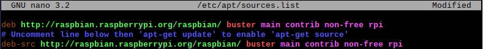
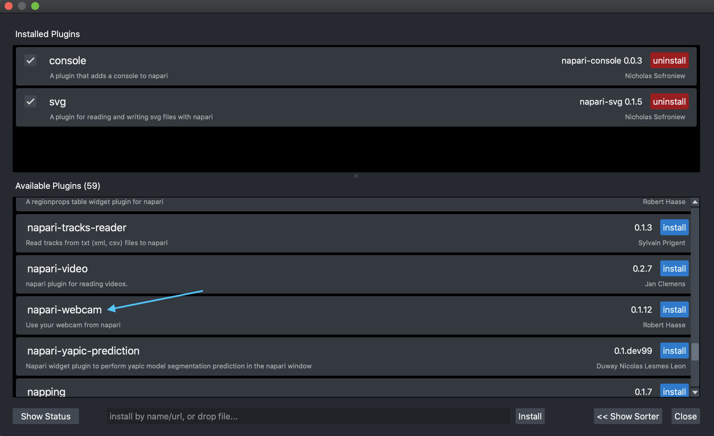
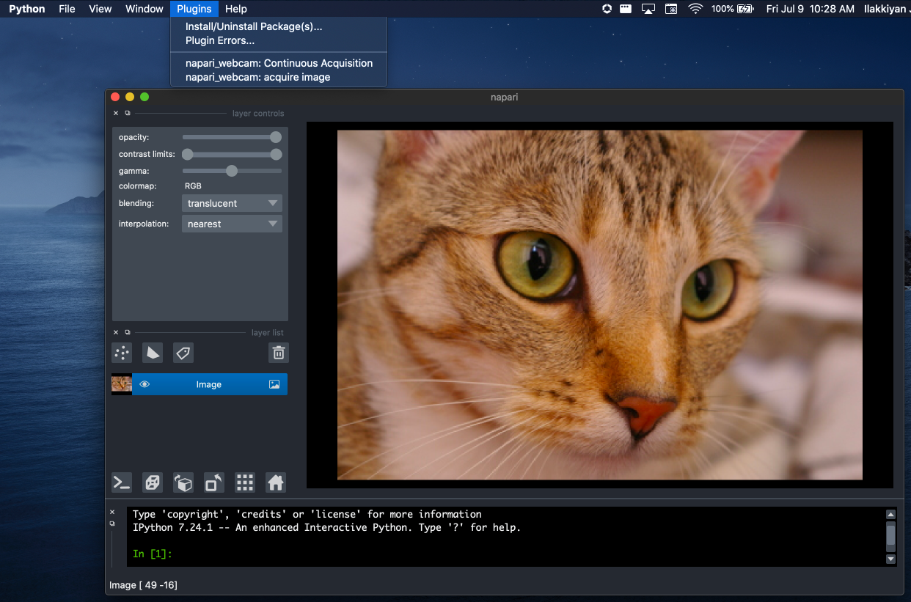

# Installing Napari on a Raspberry Pi
Validated July 9th, 2021

## Building Qt from source
------------
First, Qt is built from its source repository (apparently the Qt versions in the Raspbian repos might be out of date, according to this [forum thread](https://www.raspberrypi.org/forums/viewtopic.php?t=308911)). 

The instructions below are taken from [here](https://github.com/tiagordc/rpi-build-qt-pyqt) (we copy them here for posterity). Some steps below take several hours. I have a bolded note above those steps so you can go do something else during that time.

```
1. Uncomment source line in sources.list

sudo nano /etc/apt/sources.list
```


```
2. Update packages

sudo apt update
sudo apt full-upgrade
sudo reboot now
```

```
3. Install dependencies
sudo apt-get build-dep qt5-default

sudo apt-get install -y '^libxcb.*-dev' libx11-xcb-dev libglu1-mesa-dev libxrender-dev libxi-dev libxkbcommon-dev libxkbcommon-x11-dev

sudo apt-get install -y flex bison gperf libicu-dev libxslt-dev ruby nodejs

sudo apt-get install -y libxcursor-dev libxcomposite-dev libxdamage-dev libxrandr-dev libxtst-dev libxss-dev libdbus-1-dev libevent-dev libfontconfig1-dev libcap-dev libpulse-dev libudev-dev libpci-dev libnss3-dev libasound2-dev libegl1-mesa-dev

sudo apt-get install -y libasound2-dev libgstreamer1.0-dev libgstreamer-plugins-base1.0-dev libgstreamer-plugins-bad1.0-dev

sudo apt-get install -y freeglut3-dev

sudo apt install -y libclang-6.0-dev llvm-6.0
```

**This next step will take a long time, 5+ hours**
```
4. Run the Qt build script (this will take a long time)

wget https://raw.githubusercontent.com/tiagordc/raspberry-pi-qt-builds/master/build-qt.sh

sudo chmod +x build-qt.sh

sh build-qt.sh
```

```
5. Install Qt

cd / 

sudo tar xf /home/pi/qtbuild/Qt5.15.2-rpi-bin-minimal.tgz
```

```
6. Add Qt to PATH (add the last two lines to bashrc)

nano ~/.bashrc

export LD_LIBRARY_PATH=/usr/local/Qt-5.15.2/lib:$LD_LIBRARY_PATH
export PATH=/usr/local/Qt-5.15.2/bin:$PATH
```

**The last two commands will each take a long time, 3+ hours at the least for each**
```
7. Build PyQt5

sudo apt-get install sip-dev

cd /usr/src

sudo wget https://www.riverbankcomputing.com/static/Downloads/sip/4.19.24/sip-4.19.24.tar.gz

sudo wget https://files.pythonhosted.org/packages/28/6c/640e3f5c734c296a7193079a86842a789edb7988dca39eab44579088a1d1/PyQt5-5.15.2.tar.gz

sudo tar xzf sip-4.19.24.tar.gz

sudo tar xzf PyQt5-5.15.2.tar.gz

cd sip-4.19.24

sudo python3 configure.py --sip-module PyQt5.sip

sudo make -j4

sudo make install

cd ../PyQt5-5.15.2

sudo python3 configure.py --qmake /usr/local/Qt-5.15.2/bin/qmake --confirm-license

sudo make -j4

sudo make install
```

```
8. Test (note that when I ran sip -V, I got a command not found error, but everything else worked fine so it was a non-issue)

cd
sip -V
sudo wget https://raw.githubusercontent.com/tiagordc/rpi-build-qt-pyqt/master/test.py
python3 test.py
```

## A simple Napari test
------
We first need to install `scikit-image`. 

```
sudo pip3 install scikit-image
sudo apt-get install libatlas-base-dev
```
The reason for the `sudo apt-get` above is because I ran into an issue when just doing `pip3 install scikit-image`:
```
ImportError: libf77blas.so.3: cannot open shared object file: No such file or directory
```


Create a file `test-napari.py` and fill it with the following:
```
import napari
from scikit-image import data

viewer = napari.view_image(data.cat(), rgb=True)
napari.run()
```

Run the file
```
python3 test-napari.py
```

## Continuous webcam image acquisition (tested with the RPi Camera module)
-----
With Napari open (e.g by running the test script above), click the `Plugins` tab at the top (see image below). Then click `Install/uninstall Package(s)...`. 

Scroll for `napari-webcam` in the `Available Plugins` section and click install. Alternatively you can just type in `napari-webcam` in the textbox to install it from there:




Click the `Plugins` tab at the top again. You should now see two more options. Click `napari_webcam: Continuous Acquisition`.
